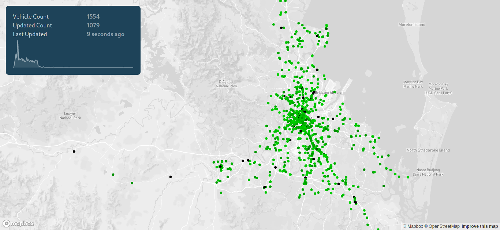
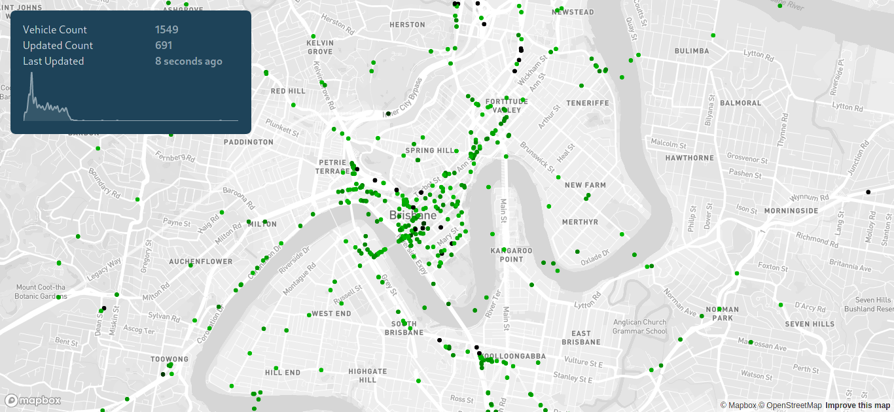
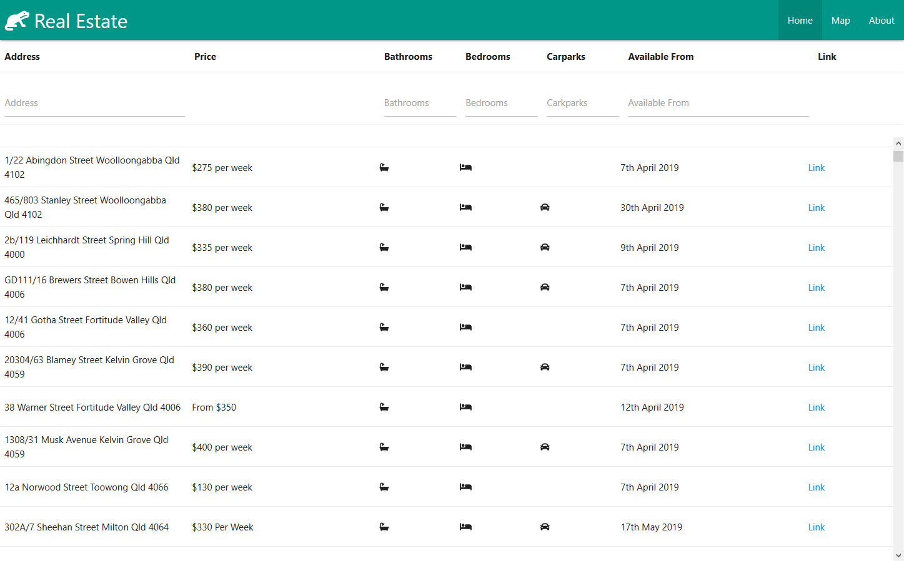
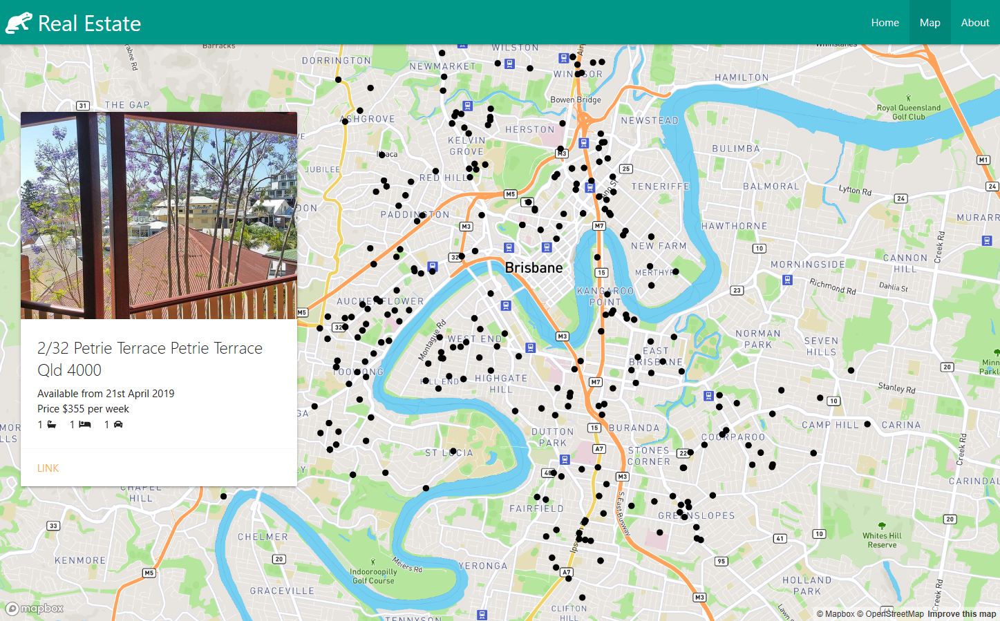

# Projects

Recently I've been working on a few projects in my spare time, most of these are available Github.

## 2020: Brisbane Buses

I spent a bit of time playing around with GTFS realtime feeds
published by Translink.
GTFS (General Transit Feed Specification) is a Google specification for public transport data,
its how Google Maps displays public transport information.

The GTFS realtime feeds receives updates around every 5 seconds,
so to give you an idea of the volume of data, every 5 seconds it publishes around 700 bus updates.

The backend is written in NodeJS with Typescript, which takes the protobuf encoded GTFS realtime feed and
publishes it as a GraphQL api (using GraphQL subscriptions to send down realtime updates to the clients).

The frontend is written in React and Typescript, and uses MapboxGL for the map.
It was written to be as efficient as possible, only updating the buses that have changed since the last update.
The end result is a dashboard that can easily display over 1600 buses in realtime without noticable lag.

The application is deployed using Docker, with 3 containers:

- A container that hosts the static frontend using NGINX
- A container that hosts the backend NodeJS application
- Traefik that acts as a proxy for the other containers.

I used this as an excuse to explore building a full stack real time application
that processes a sizable amount of data every few seconds. A couple of key goals of the project were to:

- Experiment with GraphQL to provide real time data to a web application
- Create a map based React application that was performance enough to handle the volume of real time data
- Explore the performance characteristics of the frameworks I'm using

## 2019: Real Estate

I moving apartments in 2019 and wanted a better way to search for potential apartments near the suburbs I want to move to.
This was also an excuse for me to delve into Vue.js, Node and Typescript.

What I wanted from the project is a simple site allowing me to easily view all available apartments in the suburbs I'm interested.
I decided to extend the idea a bit more and added:

- A table view of apartments with information about them

  

- A map view showing all apartments on a map
  
